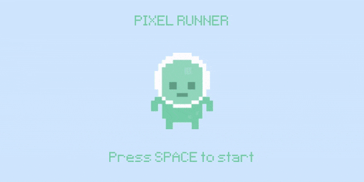

# Pixel Runner
I'm currently learning Python through [Exercism](https://exercism.org/), but I've wanted to try out a few of the concepts in real project. Since I love computer games, using [Clear Code's](https://www.youtube.com/@ClearCode) Ultimate Guide to Python seemed like a great chance to try a few things out.

## What I Learnt
### The Basics
- **Pygame:** Does a lot of things Python can't do natively, like draw images, play sounds, check for input without pausing the entire code, and also has useful tooks for things like timers, collisions, and displaying text.
- **The Event Loop:** The part of the code which checks for events like player inputs and timers, so that the individial frame can be updated in response.  
- **Surfaces:** The *display durface* is the game window and is unique and always visible; other *surfaces* are images placed on the display surface, flexible in number and only visible when on the display surface
- **Blit:** Block Image Transfer (used in screen.blit)
- **Text:** Treated a bit like any other image; import it, place it on a surface, blit it onto the display surface.
- **Sound and Mixer**: When trying to make the game music play, it was very distorted if I used the guide's method of pygame's sound module. Instead, I had to switch to using the mixer module and implement that using the Pygame docs.
- **Animation**: Essentially just simple logic to cycle through the animation frames; can use a timer or variable to do this, resetting a variable when it hits max, or switching based on previous values with a timer.
- **Collisions**: A couple of different methods using Pygame's built in collision handling for rects and for sprites.

### More Advanced
- **Classes / Sprites:** Following the guide, initially everything was in the main code block. That meant lots of things related to the player and obstacles were spread out and it could be hard to track what's going on. Placing all of the player-relevant code into a sprite class means it's all there in one place and much more readable.

## Other Thoughts
- **Memory management:** Wouldn't have thought it a big deal in a game like this, but in another project where I was constantly spawning obstacles, I noticed how quickly the game slowed down if they weren't destroyed after leaving the screen. Important to keep things like that in mind!

### Resources
- [Pygame Documentation](https://www.pygame.org/docs/)
- [The Ultimate Introduction to Pygame](https://www.youtube.com/watch?v=AY9MnQ4x3zk)

### Assets
- **Art:** [Platformer Art Deluxe](https://opengameart.org/content/platformer-art-pixel-edition) by [Kenney](www.kenney.nl)
- **Sound Effects:** [8 bit SFX Pack](https://maskedsound.itch.io/8-bit-sfx-pack) by [Masked Sound](https://maskedsound.com/)
- **Music**: [Action Chiptunes](https://opengameart.org/content/5-chiptunes-action) by [Juhani Junkala](https://juhanijunkala.com/)